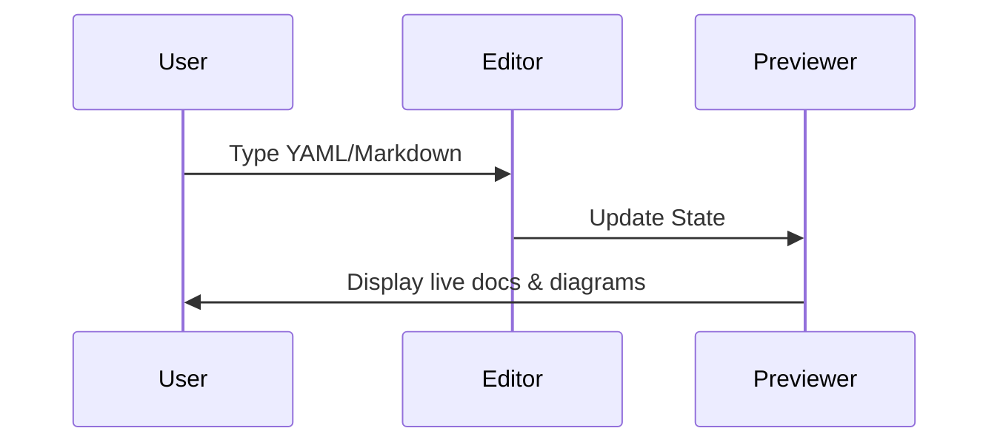
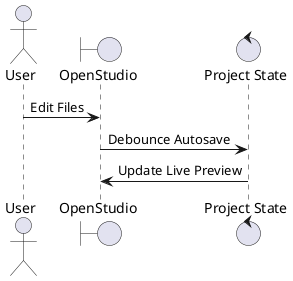

# OpenStudio Project Documentation

Welcome to your **OpenStudio** project. This Markdown file serves as supporting documentation.

## Diagram Example (Mermaid)

Here is a sequence diagram imported from a standalone Mermaid file:

@import "template.mmd"

## Diagram Example (PlantUML)

Here is a component diagram imported from a standalone PlantUML file:

@import "template.puml"

