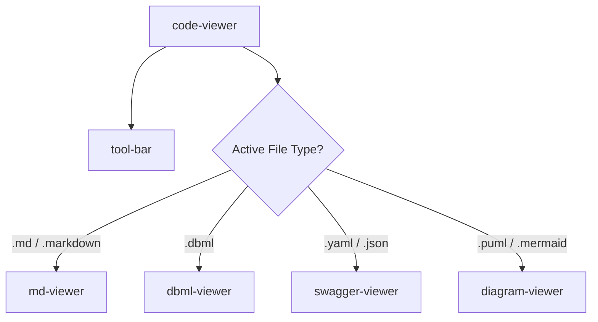

# Implementation Plan: Modular Viewer Architecture & CSS Refactoring

We want to refactor the monolithic viewer system to improve modularity, lifecycle management, and separate design aesthetics from JavaScript templates. 

Specifically, this plan addresses:
1. **Decomposing `ViewerController`**: Creating dedicated, encapsulated viewer components for each document type (`md-viewer`, `dbml-viewer`, `swagger-viewer`).
2. **CSS Extraction**: Eliminating inline HTML `style="..."` attributes and dynamic `<style>` injection. We will create separate CSS stylesheets for each component and import them cleanly.

---

## Proposed Component Architecture

Instead of having a controller imperatively write to a raw div, the host [code-viewer.js](file:///Users/softmobile/Documents/Git/GitHub/a-chhiong/OpenStudio/web-page/src/components/viewer/code-viewer.js) will declaratively render the matching child element:



---

## Proposed Changes

### 1. Styling Refactoring (CSS Co-location & Boundaries)

We will co-locate component-specific CSS styles inside a dedicated subdirectory: `web-page/src/styles/components/`.

#### CSS Boundaries: Component UI vs. Content Styles
To maintain a clean design system, we draw a clear line between **Component UI Layout** and **Document Content Styles**:

1. **Global Variables & Tokens (`variables.css`)**: Unmodified. All components will reference these core variables (e.g., `var(--accent-color)`, `var(--text-secondary)`) to keep theme variables synchronized.
2. **Document Content Styling (`markdown.css` & `dbdocs.css`)**: Unmodified. These styles target rendered document bodies (e.g., headers, tables, code block highlighting, blockquotes). 
   - Refactored components like `<md-viewer>` and `<dbml-viewer>` will wrap their output in standard classes (`.markdown-preview` and `.dbdocs-table-container`). 
   - This allows them to inherit the existing rich styling automatically without any duplication.
3. **Component UI styles — Co-location Strategy**

   We will use **`static styles = css\`...\``** (Lit's companion styling) for components that use the **Shadow DOM** (e.g., `tool-bar`, `app-dialog`). For components that opt out of Shadow DOM via `createRenderRoot() { return this; }` (Light DOM), we use **companion CSS files** imported at the top of the JS file, since Lit's `static styles` only applies within a Shadow Root.

   | Component | DOM Mode | Style Approach |
   |---|---|---|
   | `diagram-viewer` | Light DOM | companion `diagram-viewer.css` |
   | `code-viewer` | Light DOM | companion `code-viewer.css` |
   | `md-viewer` | Light DOM | companion `md-viewer.css` |
   | `dbml-viewer` | Light DOM | companion `dbml-viewer.css` |
   | `swagger-viewer` | Light DOM | companion `swagger-viewer.css` |
   | `tool-bar` | Shadow DOM | `static styles = css\`...\`` ✅ already done |
   | `app-dialog` | Shadow DOM | `static styles = css\`...\`` ✅ already done |

   **Recommendation**: Place companion CSS files **co-located alongside their JS file** (e.g., `viewer/diagram-viewer.css` next to `viewer/diagram-viewer.js`), **not** in `src/styles/`. This is the standard approach for component-scoped styles — the stylesheet is a private implementation detail of that component, not a global concern. Only truly shared, cross-component styles belong in `src/styles/`.

   ```
   src/
     styles/               ← Global, shared only
       variables.css
       markdown.css
       dbdocs.css
       main.css
     components/
       viewer/
         diagram-viewer.js
         diagram-viewer.css  ← Co-located companion
         md-viewer.js
         md-viewer.css       ← Co-located companion
         ...
   ```

#### Architectural Decision: Light DOM vs Shadow DOM

We are explicitly forcing the viewers into the **Light DOM** (via `createRenderRoot() { return this; }`) instead of using Lit's default Shadow DOM for three critical reasons:

1. **Third-Party CSS Integration**: Libraries like Swagger UI inject their own global stylesheets. If `<swagger-viewer>` lived in a Shadow DOM, that global CSS would hit the "Shadow Wall" and fail to style the API docs.
2. **Global Content Styles Inheritance**: Your project has beautifully crafted global stylesheets for document content (`markdown.css` and `dbdocs.css`). Rendering `<md-viewer>` and `<dbml-viewer>` in the Light DOM allows them to naturally inherit these global typography and layout rules without needing to duplicate or inject the CSS into every shadow root.
3. **Accurate Canvas Measurement**: Libraries like Mermaid calculate precise bounding boxes before rendering SVGs. Bounding box calculations (`getBoundingClientRect`) can sometimes behave unpredictably across shadow boundaries. The Light DOM ensures these measurements (and global font inheritances like `Outfit`) are 100% accurate.

---

### 2. Component Layout & Refactoring

#### [NEW] [md-viewer.css](./web-page/src/styles/components/md-viewer.css)
CSS rules for markdown layout, transclusion/import errors, scrollbars, and workspace links.

#### [NEW] [md-viewer.js](./web-page/src/components/viewer/md-viewer.js)
* **Goal**: Render Markdown documents, parsing transclusions and sub-diagrams.
* **Logic**: Wraps the markdown parsing options, links interception (`open-ref-file` events dispatching), and calls `renderDiagrams` on render.

---

#### [NEW] [dbml-viewer.css](./web-page/src/styles/components/dbml-viewer.css)
Styling for the DBML document workspace.

#### [NEW] [dbml-viewer.js](./web-page/src/components/viewer/dbml-viewer.js)
* **Goal**: Process and compile DBML schemas.
* **Logic**: Hooks into `@dbml/core` and workspace files, converts dbml to markdown, and renders diagrams.

---

#### [NEW] [swagger-viewer.css](./web-page/src/styles/components/swagger-viewer.css)
Styling for placeholder buttons, Swagger containers, and theme filter overrides.

#### [NEW] [swagger-viewer.js](./web-page/src/components/viewer/swagger-viewer.js)
* **Goal**: Render OpenAPI specifications.
* **Logic**: Resolves references, checks if it is a child YAML/JSON spec fragment, handles Swagger UI lifecycle mount/unmount and cleanup.

---

#### [NEW] [diagram-viewer.css](./web-page/src/styles/components/diagram-viewer.css)
Extracted CSS rules for viewport, canvas, controls, loading screens, and SVG alignment.

#### [MODIFY] [diagram-viewer.js](./web-page/src/components/viewer/diagram-viewer.js)
* **Refactor**: Remove `_injectStyles()` method completely.
* **Refactor**: Import `./diagram-viewer.css` instead. Remove inline styles.

---

#### [NEW] [code-viewer.css](./web-page/src/styles/components/code-viewer.css)
Unified scrollbar styles, flex container settings, printing behaviors.

#### [MODIFY] [code-viewer.js](./web-page/src/components/viewer/code-viewer.js)
* **Refactor**: Remove inner `<style>` blocks and inline styles.
* **Refactor**: Import `./code-viewer.css`.
* **Behavior**: Subscribes to project state. Renders the appropriate custom viewer tag based on active file extension. Fowards export requests from the toolbar to the active viewer.

---

#### [MODIFY] [viewer-controller.js](./web-page/src/components/viewer/viewer-controller.js)
Slimmed down to a lean **coordinator**. Per your separation of concerns guidance, it retains responsibilities that are genuinely cross-cutting and not owned by any single viewer:
- **State subscriptions**: Subscribes to `projectManager.files$`, `activeFile$`, and `theme$` and pushes them into the host (`code-viewer`).
- **File-type routing**: Determines which viewer tag to render based on file extension and sets `this.host.currentContentType`.
- **Export dispatch**: Delegates export actions (`handleExportHTML`, `handleExportSVG`, etc.) to the currently active child viewer via a reference.
- **`open-ref-file` link interception**: The global click handler for cross-file navigation in Markdown/DBML stays here as it is a workspace-level concern, not a viewer concern.

All format-specific rendering logic (parsing, compiling, rendering libraries) moves out into the dedicated viewer components.

---

## Verification Plan

### Automated Verification
* Run build scripts: `npm run build` (or equivalent) to make sure there are no build errors with newly imported CSS files and dynamic components.

### Manual Verification
1. **File Type Routing**: Open `.md`, `.dbml`, `.yaml`, `.puml`, `.mermaid` files and ensure they load their respective viewer interface.
2. **CSS Inspection**: Verify layout, margins, themes, scrollbars, and dark mode filters are correctly applied via the new CSS stylesheets instead of inline attributes.
3. **Exports**: Export HTML, SVG, and PDF to confirm they are generated correctly from the refactored components.
4. **Lifecycle Check**: Switch between formats multiple times to verify Swagger and Mermaid instances cleanly clean up without throwing exceptions or memory leaks.
